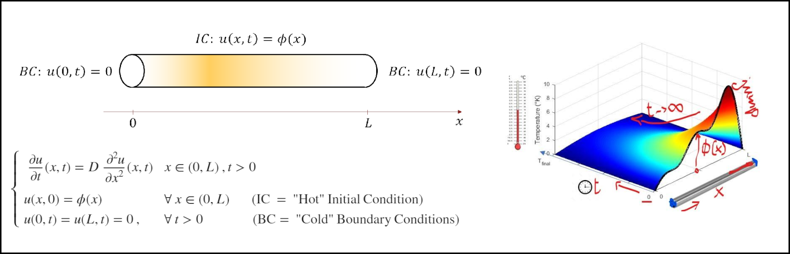
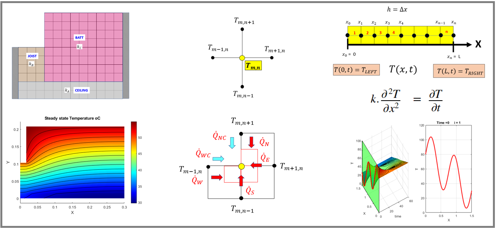

# Examples in Heat Transfer 

This repository shows examples of using [MATLAB](https://www.mathworks.com/products/matlab.html)®, [Symbolic Math Toolbox](https://www.mathworks.com/products/symbolic.html)™, and [Partial Differential Equation Toolbox](https://www.mathworks.com/products/pde.html)™ for solving canonical problems in Heat Transfer.

# Setup 

Each example have their own folder, and can be copied and used individually. Open the folder and run the main live script, or use the links below. 

# Examples
## Heat Conduction Through Composite Wall

[Open live script locally](./Composite_Wall/Conductive_Composite_Walls.mlx)

Requires [MATLAB](https://www.mathworks.com/products/matlab.html), [Symbolic Math Toolbox](http://%28https//www.mathworks.com/products/symbolic.html), and [Partial Differential Equation Toolbox](https://www.mathworks.com/products/pde.html).

## Analytically Solving 2D Steady\-State Heat Equation on Thin, Rectangular Plate

[Open live script locally](./Separation_of_Variables/Separation_of_Variables_Rectangle.mlx)

Requires [MATLAB](https://www.mathworks.com/products/matlab.html), [Symbolic Math Toolbox](http://%28https//www.mathworks.com/products/symbolic.html), and [Partial Differential Equation Toolbox](https://www.mathworks.com/products/pde.html).

## Solving Transient Heat Equation 

[Open live script locally](./Transient_Heat_Equation/HeatEquationDemo.mlx)

[Link to video description](https://www.youtube.com/watch?v=mICYVEwe6Jg&list=PLn8PRpmsu08oV_uJZBB7jIemn4-lxN7yL&index=4)  

Requires [MATLAB](https://www.mathworks.com/products/matlab.html), and [Symbolic Math Toolbox](http://%28https//www.mathworks.com/products/symbolic.html).

## Heat Transfer Analysis \- Heat Transfer and Energy Balance in 1D and 2D using Finitie Difference Methods and PDE Toolbox

[Open live script series locally](./FD_and_PDE_Solution/START_HERE_PLEASE.mlx)

Requires [MATLAB](https://www.mathworks.com/products/matlab.html), [Symbolic Math Toolbox](http://%28https//www.mathworks.com/products/symbolic.html), and [Partial Differential Equation Toolbox](https://www.mathworks.com/products/pde.html).

# Getting Started 
-  Check [documentation for Symbolic Math Toolbox](https://www.mathworks.com/help/symbolic/index.html), and try the self\-paced course [Introduction to Symbolic Math with MATLAB](https://matlabacademy.mathworks.com/details/introduction-to-symbolic-math-with-matlab/symbolic).  
-  Check [documentation for Partial Differential Equation Toolbox](https://www.mathworks.com/help/pde/index.html?s_tid=CRUX_lftnav). 
-  Learn more about capabilities of [MATLAB Live Editor](https://www.mathworks.com/products/matlab/live-editor.html).  

# License

The license is available in the [License.txt](./License.txt) file in this repository.

# Community Support

[MATLAB Central](https://www.mathworks.com/matlabcentral)

Copyright 2024 The MathWorks®, Inc.
