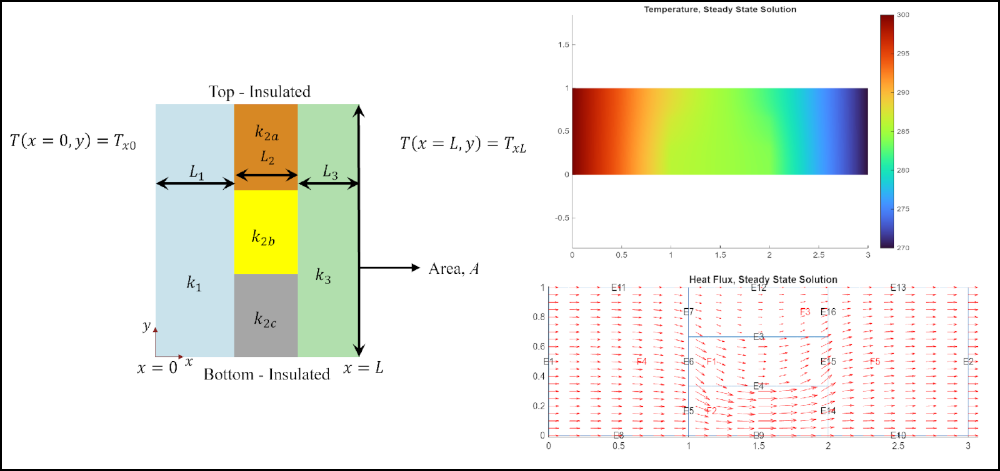
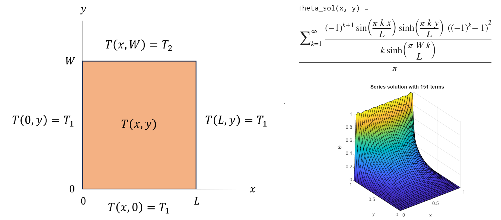
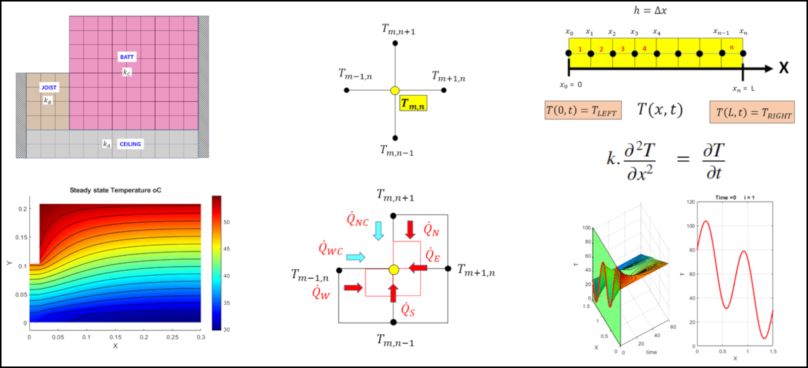
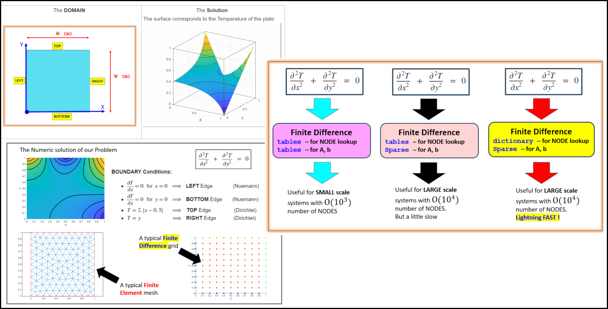
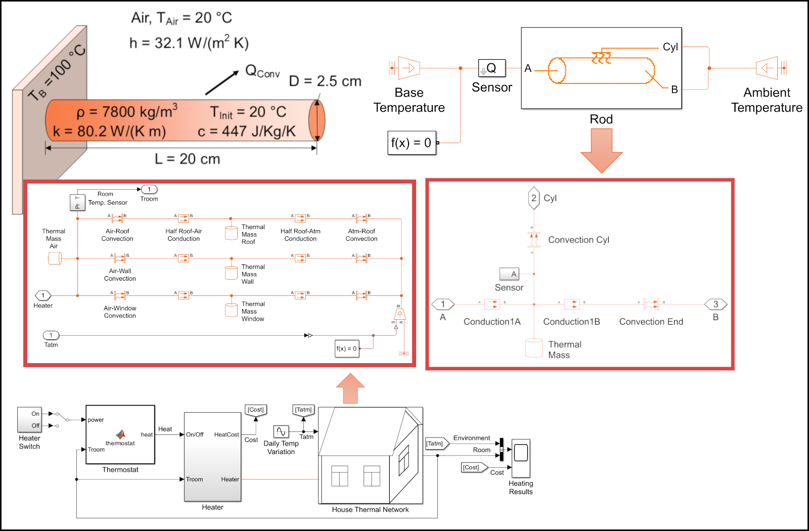
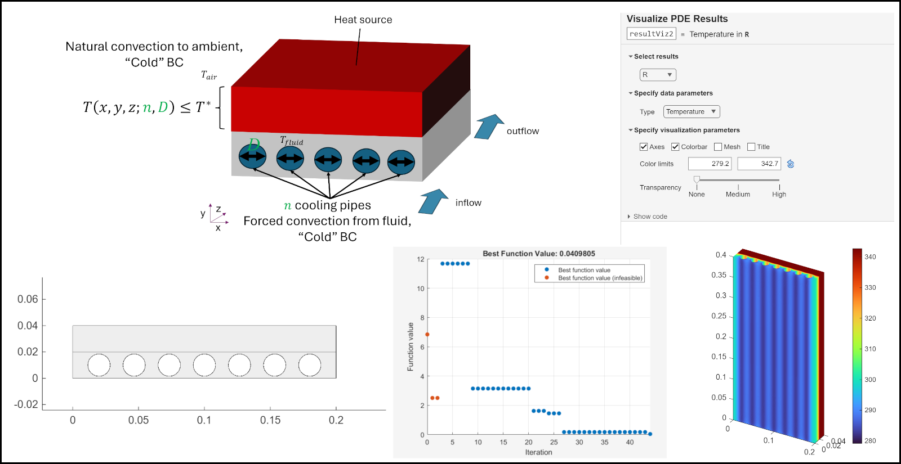

# Examples in Heat Transfer 

## Table of Contents
[Tools](#tools)
 
[Setup and Usage](#setup-and-usage)
 
[Examples](#examples)
 
&emsp;[Heat Conduction Through Composite Wall ](#heat-conduction-through-composite-wall-)
 
&emsp;[Analytically Solving 2D Steady\-State Heat Equation on Thin, Rectangular Plate](#analytically-solving-2d-steady\-state-heat-equation-on-thin,-rectangular-plate)
 
&emsp;[Solving Transient Heat Equation ](#solving-transient-heat-equation-)
 
&emsp;[Heat Transfer and Energy Balance in 1D and 2D using Finite Difference Methods and PDE Toolbox](#heat-transfer-and-energy-balance-in-1d-and-2d-using-finite-difference-methods-and-pde-toolbox)
 
&emsp;[Finite Difference and Finite Element Methods for 2D Steady\-State Heat Transfer \- Indexing variations](#finite-difference-and-finite-element-methods-for-2d-steady\-state-heat-transfer-\--indexing-variations)
 
&emsp;[Lumped Modeling of Heat Transfer Systems \- From Iron Rod to House Thermal Network](#lumped-modeling-of-heat-transfer-systems-\--from-iron-rod-to-house-thermal-network)
 
&emsp;[Modeling and Optimization of Cooling Pipes](#modeling-and-optimization-of-cooling-pipes)
 
[Getting Started ](#getting-started-)
 
[License](#license)
 
[Community Support](#community-support)
 

This repository shows examples of using [MATLAB](https://www.mathworks.com/products/matlab.html)®, [Symbolic Math Toolbox](https://www.mathworks.com/products/symbolic.html)™, [Partial Differential Equation Toolbox](https://www.mathworks.com/products/pde.html)™, and [Simscape™ Fluids](https://www.mathworks.com/products/simscape-fluids.html)™ for solving canonical problems in Heat Transfer. The focus of these examples are **complementing the analytical (pen\-and\-paper) solutions with computational workflows**. From various computational approaches, educators can employ those closer to their teaching style and goals. Through study of these fundamental examples students learn different ways to apply computational tools in solving heat transfer problems and use them in real world applications. Here are the highlights of the discussed workflows and related tools. 

# Tools
## [MATLAB](https://www.mathworks.com/products/matlab.html)
-  Creating interactive live script for teaching and solving example problems 
-  Implementing your own numerical methods to solve equations  
-  Use tested and trusted numerical solvers to solve various types algebraic and differential (ODE, BVP, 1D\-PDE) equations  
-  Visualize and analyze results 
-  Use tools from more than 100 toolboxes and addons  

## [Symbolic Math Toolbox](https://www.mathworks.com/products/symbolic.html)
-  Symbolic solution of algebraic and differential equation  
-  Symbolic calculation with variables associated with physical units, and performing dimensional analysis and verification 
-  Visualization of symbolic equations 

## [Partial Differential Equation Toolbox](https://www.mathworks.com/products/pde.html)
-  Solve steady\-state and transient heat transfer problems using finite element analysis in 2D/3D 
-  Visualize and post\-process results 
-  Couple thermal systems with structural stress analysis  
-  Approximate dynamic characteristics using reduced\-order models 

## [Simscape™ Fluids](https://www.mathworks.com/products/simscape-fluids.html) 
-  Block\-based modeling with components representing physical parts and phenomena  
-  System level modeling of thermal and fluid systems 
-  Connection to multi\-domain system (mechanical, electrical) for real\-world applications 
-  Create model of lab experiments for lab pre\-work/analysis 

# Setup and Usage

Each example have its own folder, and can be copied and used individually. Open the folder and run the main live script, or use the links below. 

# Examples
## Heat Conduction Through Composite Wall 

[Open live script locally](./Composite_Wall/Conductive_Composite_Walls.mlx)

Requires [MATLAB](https://www.mathworks.com/products/matlab.html), [Symbolic Math Toolbox](http://www.mathworks.com/products/symbolic.html), and [Partial Differential Equation Toolbox](https://www.mathworks.com/products/pde.html).

-  Steady\-state conduction  
-  Thermal resistance models in 2D 
-  FEA models in 2D and 3D 
-  Temperature and flux visualization 
-  Interactive parameter  variations  

## Analytically Solving 2D Steady\-State Heat Equation on Thin, Rectangular Plate

[Open live script locally](./Separation_of_Variables/Separation_of_Variables_Rectangle.mlx)

Requires [MATLAB](https://www.mathworks.com/products/matlab.html), [Symbolic Math Toolbox](http://www.mathworks.com/products/symbolic.html), and [Partial Differential Equation Toolbox](https://www.mathworks.com/products/pde.html).

-  Step\-by\-step solution of heat equation with method of separation of variables 
-  Visualization of analytical solution 
-  Comparison with FEA solution (PDE Toolbox) 
-  Lumped Modeling of Heat Transfer Systems 

## Solving Transient Heat Equation 

[Open live script locally](./Transient_Heat_Equation/HeatEquationDemo.mlx)

[Link to video description](https://www.youtube.com/watch?v=mICYVEwe6Jg&list=PLn8PRpmsu08oV_uJZBB7jIemn4-lxN7yL&index=4)  

Requires [MATLAB](https://www.mathworks.com/products/matlab.html), and [Symbolic Math Toolbox](http://www.mathworks.com/products/symbolic.html).

-  Derivation of heat equation and validation of unit consistency  
-  Symbolic solution of transient heat equation with homogeneous BC using Fourier analysis and separation of variables  
-  Visualization of Fourier modes and embedding  
-  Interactive controls to choose material properties and solution parameters  

! [Overview figure of solving transient heat equation](_figures/fig_Transient_Heat_Equation.png)

## Heat Transfer and Energy Balance in 1D and 2D using Finite Difference Methods and PDE Toolbox

[Open live script series locally](./FD_and_PDE_Solutions_Intro/START_HERE_PLEASE.mlx)

Requires [MATLAB](https://www.mathworks.com/products/matlab.html), [Symbolic Math Toolbox](http://www.mathworks.com/products/symbolic.html), and [Partial Differential Equation Toolbox](https://www.mathworks.com/products/pde.html).

-  Thermal analysis of **1D transient** heat conduction: explicit (Forward Time Central Space) and implicit (standard and Crank\-Nicolson) methods 
-  Thermal analysis of  **2D steady\-state** heat conduction: a standard explicit FD technique for solving Laplace's equation on a simple square sheet 
-  Thermal analysis of  **2D steady\-state** heat transfer: an "authentic" house insulation design case study supporting 2D conduction and convection 
-  Derivation of Finite Difference stencils and their implementations with symbolic computing 
-  Using textural indexing in Tables to assemble the Finite Difference system equations 
-  Validation of numerical methods by PDE solvers in MATLAB or Partial Differential Equation Toolbox 
-  Visualization of results and dynamics of the system 

## Finite Difference and Finite Element Methods for 2D Steady\-State Heat Transfer \- Indexing variations

[Open live script series locally](./FD_and_PDE_Solutions_Indexing/DEMO_START_HERE_PLEASE.mlx)

Requires [MATLAB](https://www.mathworks.com/products/matlab.html), [Symbolic Math Toolbox](http://www.mathworks.com/products/symbolic.html), and [Partial Differential Equation Toolbox](https://www.mathworks.com/products/pde.html)

-  Square domain with mix od Dirichlet and Neumann boundary conditions 
-  Finite element solution with PDE Toolbox 
-  Finite difference solution developed from scratch with three ways to manage and implement the Finite Difference methods 
-  1) tables for NODE lookup and storing A and b matrices  
-  2) table for NODE lookup and sparse matrices for storing A and b  
-  3) dictionary for NODE lookup and space matrices for storing A and b \[fastest implementation\]  

## Lumped Modeling of Heat Transfer Systems \- From Iron Rod to House Thermal Network

[Open live script locally](./Lumped_Model_Heat_Transfer/lumped_model_heat_transfer.mlx)

Requires [MATLAB](https://www.mathworks.com/products/matlab.html), [Simulink](https://www.mathworks.com/products/simulink.html), and [Simscape](https://www.mathworks.com/products/simscape.html)

-  Explaining conduction, convection, and thermal mass through a simple canonical problem (heat transfer in a rod) 
-  Step\-by\-step addition of physical phenomena to increase model complexity gradually 
-  Comparison of analytical and lumped model solution  
-  Comparison of computational results for modeling the rod with one vs many segments 
-  Using the same concept for modeling a simple house thermal network 

## Modeling and Optimization of Cooling Pipes

[Open heat transfer live script locally](./Cooling_Pipes/Conduction_Block_with_Cooling_Pipes.mlx)

Requires [MATLAB](https://www.mathworks.com/products/matlab.html) and [Partial Differential Equation Toolbox](https://www.mathworks.com/products/pde.html)

-  Generating the geometry with parametric features (number and size of pipes in the block) 
-  Evaluation of boundary condition to solid part for natural and forced convection 
-  Finite element solution of the steady\-state heat transfer problem with a heat source 
-  Analysis of the solution with Visualize PDE Results live task 

[Open optimization live script locally](./Cooling_Pipes/Optimize_Number_and_Size_Pipes.mlx)

Requires [MATLAB](https://www.mathworks.com/products/matlab.html), [Partial Differential Equation Toolbox](https://www.mathworks.com/products/pde.html), [Optimization Toolbox](https://www.mathworks.com/products/optimization.html)™ and [Global Optimization Toolbox](https://www.mathworks.com/products/global-optimization.html)™

-  Design optimization of a cooling block (number of pipes and their hydraulic diameter) 
-  Using surrogate optimization solver (appropriate when evaluation of objective function is computationally expensive) 
-  Visualization of the optimal solution 

# Getting Started 
-  Check [documentation for Symbolic Math Toolbox](https://www.mathworks.com/help/symbolic/index.html), and try the self\-paced course [Introduction to Symbolic Math with MATLAB](https://matlabacademy.mathworks.com/details/introduction-to-symbolic-math-with-matlab/symbolic).  
-  Check [documentation for Partial Differential Equation Toolbox](https://www.mathworks.com/help/pde/index.html?s_tid=CRUX_lftnav). 
-  Check [documentation for Simscape](https://www.mathworks.com/help/simscape/index.html), and try the self\-paced course [Simscape Onramp](https://matlabacademy.mathworks.com/details/simscape-onramp/simscape).  
-  Learn more about capabilities of [MATLAB Live Editor](https://www.mathworks.com/products/matlab/live-editor.html).  

# License

The license is available in the [License.txt](./License.txt) file in this repository.

# Community Support

[MATLAB Central](https://www.mathworks.com/matlabcentral)

Copyright 2024 The MathWorks®, Inc.

